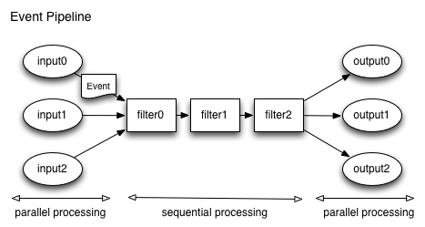

# General

Lightweight log/event processor.

Goals:

  * fast
  * easy to deploy
  * simple configuration

Concept:

The underlying idea is a very simple concept that is based on pipes and filters. An event gets registered by an input, put through a couple of filters and in the end is published by an output.

## Getting started

### Prebuilt binaries

  * [Linux x86_64](http://dirtyhack.net/d/translog/latest/translog.linux-x86_64)
  * [Mac OSX x86_64](http://dirtyhack.net/d/translog/latest/translog.osx-x86_64)

<pre>
[shell1] $ wget http://dirtyhack.net/d/translog/latest/translog.linux-x86_64 -O translog
[shell1] $ chmod +x translog
[shell1] $ echo "
<b>[input.File]
source=file0

[filter.KeyValueExtractor]

[output.Stdout]</b>
" > translog.conf

[shell1] $ chmod a+rx translog
[shell1] $ ./translog -config demo.conf

[sheel2] $ echo "foo=bar baz baz baz" >> file0

[shell1]
2013/09/27 18:01:54 [inputProcessor] register *translog.FileReaderPlugin
2013/09/27 18:01:54 [filterChain] register *translog.KeyValueExtractor
2013/09/27 18:01:54 [outputProcessor] register *translog.StdoutWriterPlugin
2013/09/27 18:01:54 [EventPipeline] 0 msg, 0 msg/sec, 0 total, 5 goroutines
2013/09/27 18:02:04 [EventPipeline] 0 msg, 0 msg/sec, 0 total, 6 goroutines
<#Event>  Host: bender.local
  Source: file://file0
  InitTime: 2013-09-27 18:02:10.40223812 +0200 CEST
  Time: 2013-09-27 18:02:10.402238172 +0200 CEST
  Raw:
foo=bar baz baz baz
  Fields:
     [foo] bar
2013/09/27 18:02:14 [EventPipeline] 1 msg, 0 msg/sec, 1 total, 6 goroutines
CTRL-C
</pre>

### Compile

<pre>
$ git clone https://github.com/invadersmustdie/translog.git
$ cd translog
$ rake prep
$ rake
$ ./bin/translog -h
</pre>

# Sample Configuration

<pre>
[input.File]
source=/var/log/nginx/access.log

[filter.KeyValueExtractor]

[output.Statsd]
host=metrics.local
port=8125
proto=udp
field.0.raw=test.nginx.runtime:%{runtime}|ms
field.1.raw=test.nginx.response.%{RC}:1|c
</pre>

# FAQ

  <b>Q:</b> Why not use logstash?  
  <b>A:</b> First of all, logstash is awesome. It's the tool of choice if you want to do enhanced log/event processing. Translog does not intend to replace logstash at all. It just provides a lite alternative if you want to have real simple log processing.

  <b>Q:</b> How about more plugins for translog?  
  <b>A:</b> As translog tries to keep the number of dependencies down (to zero) I'm really careful about adding new plugins. If you need to work with redis, elasticsearch, ... use logstash.

  <b>Q:</b> What throughput can it handle?  
  <b>A:</b> There is no real answer to this question because it depends on the filters and configuration given. In general you will see a drop in throughput when using complex regex patterns.

  On my local box (MBP2012 2.7GHz 8GB SSD) (-cpus=1) it achieved the following numbers:

   * 1x FileReaderPlugin

<pre>
[input.File]
source=tmp/source.file0
</pre>

-> 52540 msg/sec

   * 1x FileReaderPlugin + 1x KeyValueFilter

<pre>
[input.File]
source=tmp/source.file0

[filter.KeyValueExtractor]
</pre>

-> 5168 msg/sec

   * 1x FileReaderPlugin + 1x KeyValueFilter + 1x FieldExtractor

<pre>
[input.FileReaderPlugin]
source=tmp/source.file0

[filter.KeyValueExtractor]

[filter.FieldExtractor]
field.visitorId=visitorId=([a-zA-Z0-9]+);
field.varnish_director=backend="([A-Z]+)_
field.varnish_cluster=backend="[A-Z]+_([A-Z]+)_
</pre>

-> 4926 msg/sec

## Configuration & Plugins

### Input

#### TcpReaderPlugin

Reads raw messages from tcp socket.

**Example**

<pre>
[input.Tcp]
port=8888
</pre>

#### FileReaderPlugin

Reads messsages from file.

**Example**

<pre>
[input.File]
source=tmp/source.file0
</pre>

#### NamedPipeReaderPlugin

Reads messsages from named pipe.

**Example**

<pre>
[input.NamedPipe]
source=tmp/source.pipe0
</pre>

### Filter

#### KeyValueExtractor

Extracts key/value pairs from raw message.

**Example**

<pre>
[filter.KeyValueExtractor]
# no configuration
</pre>

#### FieldExtractor

Extracts value from raw message and adds it to event. Regex pattern named in first group (parenthesis) will be used.

**Example**

<pre>
[filter.FieldExtractor]
debug=true
field.visitorId=visitorId=([a-zA-Z0-9]+);
</pre>

#### DropEventFilter

Drops event by matching field or raw message.

**Example**

<pre>
[filter.DropEventFilter]
debug=true
field.direction=c
msg.match=^foo
</pre>

#### ModifyEventFilter

Modifies fields for event.

Currently supports:

  * removing fields by name or pattern

**Example**

<pre>
[filter.ModifyEventFilter]
debug=true
field.remove.list=cookie,set-cookie
field.remove.match=^cache
</pre>

### Output

#### StdoutWriterPlugin

Writes internal structure of message to stdout.

**Example**

<pre>
[output.Stdout]
# no configration
</pre>

#### GelfWriterPlugin

Sends message in graylog2 format to given endpoint.

Gelf format: https://github.com/Graylog2/graylog2-docs/wiki/GELF

**Example**

<pre>
[output.Gelf]
debug=true
host=localhost
port=12312
proto=tcp
</pre>

#### NamedPipeWriterPlugin

TODO

#### StatsdPlugin

Sends metrics to statsd.

**Example**

<pre>
[output.Statsd]
debug=true
host=foo.local
port=8125
proto=udp
field.0.raw=test.nginx.runtime:%{runtime}|s
field.1.raw=test.nginx.response.%{RC}:1|c
field.2.raw=test.nginx.%{foo}.%{bar}:1|c
</pre>

#### NetworkSocketWriter

Writes raw message to network socket.

**Example**

<pre>
[output.NetworkSocket]
debug=true
host=localhost
port=9001
proto=tcp
</pre>
